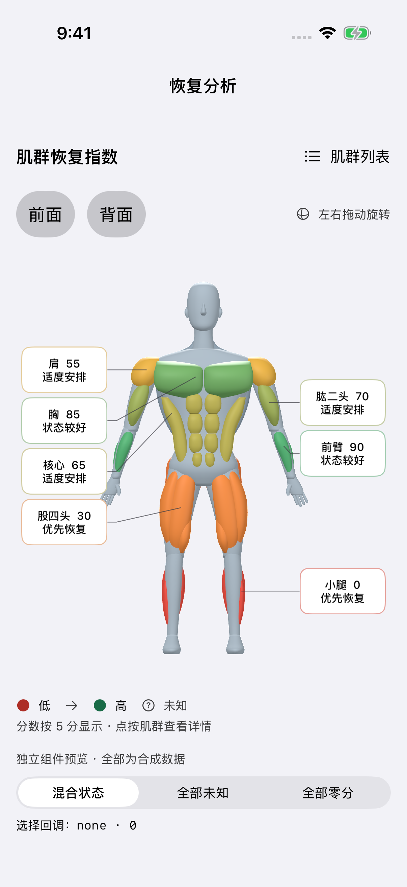
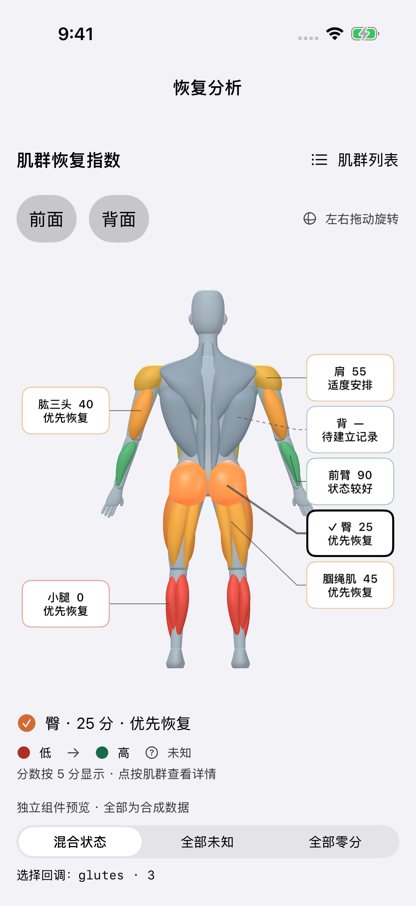
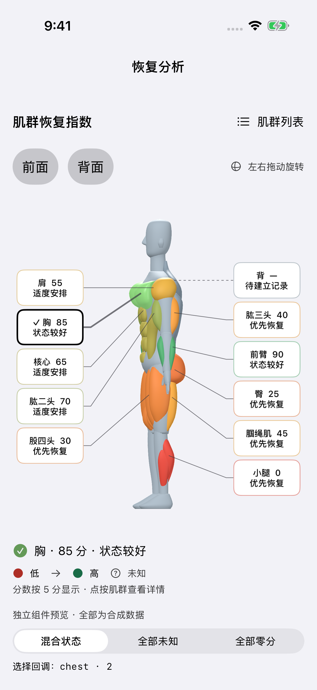
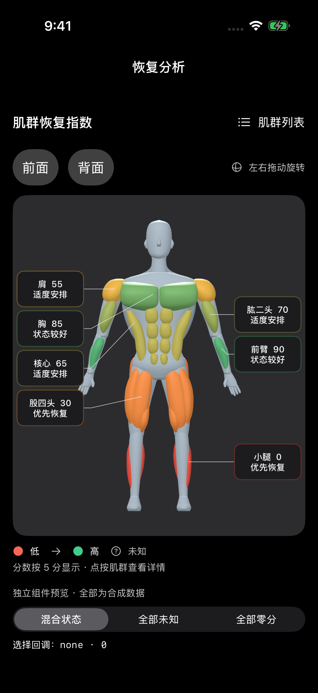
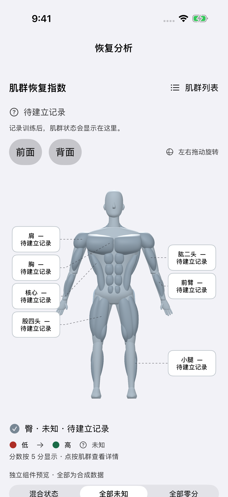
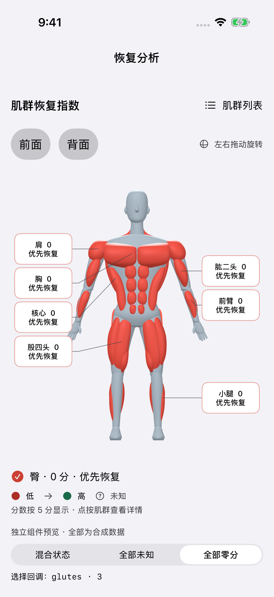
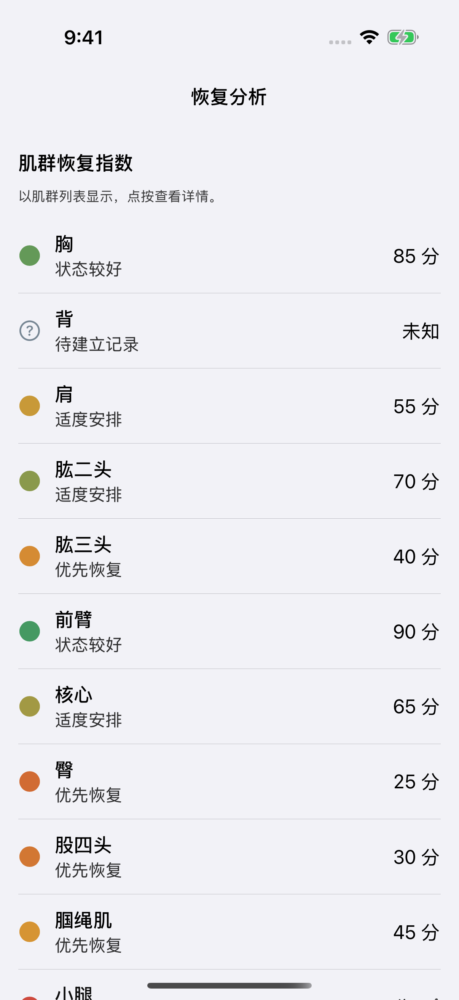

# D 组件验收记录

日期：2026-10-03（Asia/Shanghai）。工作树：`/Users/jerryszz/.codex/worktrees/a7d8/trainote`。
分支：`agent/recovery-body-map`。基础主线：`9f2682c6714668de429e51f9de113d1283358f9b`。
正式 DTO 已合入 A 的固定提交 `32e9fac26055d9b35eb791e75a0ceacd1d45e898`，共享文件未修改。
入口固定为 `BodyMapView(presentation: BodyMapPresentation, onSelect: (MuscleID) -> Void)`。

## 实际执行结果

| 验证 | 结果 | 证据 |
| --- | --- | --- |
| 独立预览构建及测试 | 7 单元 + 7 UI，14/14 通过，0 跳过 | [原始 xcresult 摘要](test-summary.json) |
| 正式 Trainote 工程注册后测试 | 7/7 BodyMap 单元测试通过 | [产品目标摘要](product-test-summary.json) |
| 正式 Trainote Release 模拟器构建 | `BUILD SUCCEEDED`，代码签名关闭 | 本工作树 `build/body-map/product-release.log` |
| 类型及边界 | 正式 DTO、缺项、unknown/0、NaN/越界、5 分舍入、上游 state、疼痛/活动受限、选择值 | `TrainoteTests/BodyMapTests.swift` |
| 模型及命中 | 11/11 ID；74 个闭合有限三维网格；24 个角度的投影、最近表面命中、标签边界/不重叠 | 同上 |
| 真实 UI 交互 | 点人体胸部、点标签、拖动侧转、前/背按钮、全部 11 个列表回调、未知与零分切换 | `BodyMapPreview/Tests/BodyMapUITests.swift` |
| 辅助功能 | 浅色列表及深浅色 3D 的对比度、44 pt 点击区域、元素说明和 traits 审计通过；大字体列表另通过 textClipped 审计 | `performAccessibilityAudit`，无忽略项 |
| 降级 | 节能模式 20 fps 实际渲染；辅助功能字号自动列表；VoiceOver/热状态/资源不可用策略单测 | UI 测试 + policy 单测 |
| 资产重现 | 重新运行 generator，JSON / mesh map 无差异；SHA-256 一致 | [资产记录](../../Trainote/Resources/BodyMap/PROVENANCE.md) |
| 静态检查 | `git diff --check`、针对本任务 Swift 文件的 `swift-format lint --strict` 通过 | 本次本地运行 |


运行环境：Xcode 26.6 / build 17F113，Swift 5 language mode、iOS 17 部署目标；
iPhone 17 Pro 模拟器，iOS 26.5 / 23F77，UDID `EEEBCCF3-913B-4683-AB3A-BB8FDFEEA7AD`，
设备名 `Trainote BodyMap D`。宿主 Apple M5 Max / 128 GiB。没有使用其他任务的 Simulator 或 DerivedData。

独立预览命令及项目生成方式见 [README](../README.md)。结果包分别保存在本工作树：
`build/body-map/delivery-tests.xcresult`、`build/body-map/product-tests.xcresult`。
两个 DerivedData 为 `build/BodyMapDerivedData` 和 `build/TrainoteBodyMapDerivedData`。

正式工程验证命令：

```sh
# 使用既有配置生成登记；按主对话委派作为单独机械提交。
.xcodegen/xcodegen/bin/xcodegen generate --spec project.yml
xcodebuild -project Trainote.xcodeproj -scheme Trainote \
  -destination 'platform=iOS Simulator,id=EEEBCCF3-913B-4683-AB3A-BB8FDFEEA7AD' \
  -derivedDataPath build/TrainoteBodyMapDerivedData \
  -only-testing:TrainoteTests/BodyMapTests \
  -resultBundlePath build/body-map/product-tests.xcresult CODE_SIGNING_ALLOWED=NO test
xcodebuild -project Trainote.xcodeproj -scheme Trainote -configuration Release \
  -destination 'generic/platform=iOS Simulator' \
  -derivedDataPath build/TrainoteBodyMapDerivedData CODE_SIGNING_ALLOWED=NO build
```

XcodeGen 2.46.0 使 `project.pbxproj` 增加/调整 206 行（151 增、55 删，含生成器排序），
确实注册了全部 BodyMap source、JSON、许可及组件单测；差异保存在 `build/body-map/registration.patch`。
生成登记按主对话明确委派纳入独立机械提交；`project.yml` 和 CI 未修改，预览 harness 未加入生产 App。
D 工程已包含全部组件 source；A/D 联合分支仍需由主对话重新生成最终工程并运行 CI。

## 性能实测

预览在前台，1 秒预热后旋转 5 秒，再等待收敛并采样 2 秒静止。
使用实际 `SCNSceneRendererDelegate.didRenderScene` 时间戳，内存为整个预览进程的 `phys_footprint` 采样峰值。

| 模式 | 实际 fps | 帧间隔 p95 | 采样帧数 | 峰值内存 | 静止 2 秒重绘 |
| --- | ---: | ---: | ---: | ---: | ---: |
| 普通（目标 30） | 30.0 | 33.6 ms | 150 | 55.9 MiB | 2 |
| 节能策略（目标 20） | 20.0 | 51.3 ms | 100 | 56.1 MiB | 1 |

原始摘要：[普通模式](performance-standard.txt)、[节能策略](performance-economical.txt)。
静止时存在偶发系统/测试重绘，没有持续按目标帧率运行；不宣称零功耗。
场景构造 XCTest 均值约 20 ms。以上不是 iPhone 真机 GPU、耗电或热稳定性结论。

## 固定 fixture 截图

以下均由最终独立预览 UI 测试直接截取，未绘制或修饰人体结果。完整图片保存在此目录。
数据来自 `BodyMapPreviewFixtures` 的固定合成值，不是恢复公式、真实用户记录或科学有效性结果。

| 正面 | 背面及选中 |
| --- | --- |
|  |  |

| 侧面旋转 | 深色 |
| --- | --- |
|  |  |

| 全部未知 | 全部 0 分 |
| --- | --- |
|  |  |

| 列表和选择回调 | 辅助功能字号 |
| --- | --- |
|  |  |

## 剩余限制

- 没有真机；未运行 iOS 17 runtime、实际 VoiceOver 语音/焦点遍历、真机能耗/热状态测试或签名分发。
- 节能 UI 是预览显式约束；实际低电量、热状态和 VoiceOver 通知路径仍需真机验证。策略分支已单测。
- 原创模型是有肌群结构的风格化真实三维网格；不是扫描人体或临床解剖模型，未作专业解剖审查。
- D 只交付组件和回调。恢复页面、算法、HealthKit、导航及最终科学/产品验收由对应工作流负责。
- 不自动合并、不发布；A/D 联合基础冻结和共享工程最终 CI 由主对话协调。
