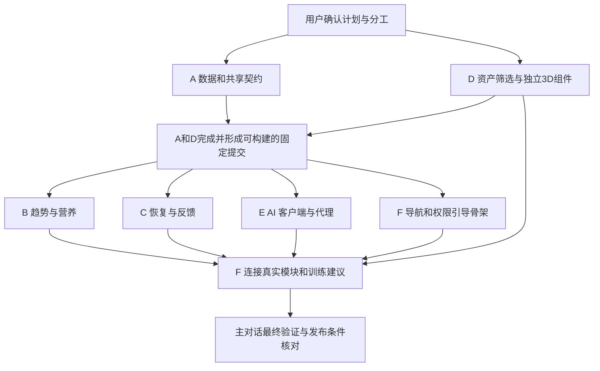

# 健康分析：并行工作树与交付计划

## 状态和授权边界

- 日期：2026-10-03；状态：**A–F 已实施，F 联合验收进行中**。规划 PR #3、A 基础 PR #4、B 趋势 PR #6、D 资产 PR #5 和拆卸修复 PR #10、E 报告 PR #7 已合并；C/F PR 仍开放，具体状态见文末快照。
- 需求基线：[实施提案](health-analysis-plan.md)；研究来源：[证据矩阵](health-analysis-evidence.md)。
- 已执行的用户决策：A、D 形成可构建固定提交后启动 B/C/E/F，无需等待 A/D 合入主线。后四个任务在各自独立工作树消费主对话批准的不可变 SHA，不追逐可变分支头。
- 原 `agent/health-analysis-plan` 是已合并的规划分支。F 当前工作树为 `/Users/jerryszz/.codex/worktrees/392a/trainote`，分支 `agent/health-integration`；已普通合并主协调批准的正式 main `60c02d7b9e4a5a0bb9f118eb162caadf7c0e38f5`，PR #9 base 为 `main`。两项有证据支持的 UI 修复与独立健康诊断均已获主协调审阅，本轮推送后运行完整 CI；两项健康失败仍未闭合。
- 实施对话使用用户默认模型，`thinking: max`；继续已有任务，不因本次文档同步另建聊天或工作树。
- 用户本次授权覆盖创建对话、独立工作树、实施、验证、提交、推送，以及本范围 PR 审阅和当前 head CI 通过后的 squash 合并，由主对话统一协调。**付费采购、正式部署和发布仍需具体授权**。

## 为什么按六条工作流拆分

两个页面共享数据、权限和计算契约；直接按页面各自实现，会重复建模并争抢迁移、备份和导航文件。
先落地一个可编译的基础层，再让趋势、恢复、3D、AI 独立推进，由集成工作流连接完整体验。
主对话负责需求、契约变更、PR 审阅、集成次序与最终验收；子对话不自行扩大范围。

| 工作流 | 分支 | 独占职责 | 主要交付 |
| --- | --- | --- | --- |
| A 数据与 Apple 健康 | `agent/health-foundation` | 新实体、迁移/备份、HealthKit 同步、授权状态、共享值类型和 fake 服务 | 可独立测试的数据基础与稳定契约 |
| B 趋势分析与营养目标 | `agent/trend-analysis` | 趋势算法、目标建议和历史查询、趋势页面 | 可解释、可暂停/撤销的自适应营养功能 |
| C 肌群恢复与反馈 | `agent/recovery-analysis` | 肌群映射、负荷/准备度、反馈与校准、恢复页容器、RIR 录入 | 可复现的恢复结果与肌群详情 |
| D 3D 人体展示 | `agent/recovery-body-map` | 资产许可、模型处理、3D 渲染/选择、无障碍列表 | 与恢复计算解耦的可点击人体组件 |
| E DeepSeek 报告服务 | `agent/ai-health-reports` | iOS 报告客户端、代理服务、鉴权/限流、提示知识与输出校验 | 合成数据端到端报告和故障降级 |
| F 导航、建议与最终集成 | `agent/health-integration` | 五 Tab、首页建议、资料库入口、首启引导/设置、推荐规则、整体体验 | 两个新模块连入现有产品，原流程不退化 |

这些是职责拆分，不是工时承诺。共享基础、资产许可和外部服务条件决定关键路径。

## 文件所有权与冲突处理

下表是当前职责边界；后续修复继续由唯一所有者处理。

| 所有者 | 可以提交的文件/目录 | 明确不负责 |
| --- | --- | --- |
| A | `Trainote/Models/Health/`、`Trainote/Services/Analysis/Contracts/`、`Trainote/Services/HealthData/`、授权/偏好持久化服务；`WorkoutModels.swift` 新字段、`BackupArchive.swift`、`TrainoteApp.swift` 的 schema/初始服务注入；迁移/备份/健康同步测试 | 趋势/恢复公式、AI 网络、页面导航 |
| B | `Trainote/Services/Analysis/Trend/`、`Trainote/Features/Trends/`、`TrainoteTests/Trend*`、趋势模块独立 UI 测试 | 修改共享实体、全局 NutritionSummary 和 Settings、AppShell |
| C | `Trainote/Services/Analysis/Recovery/`、`Trainote/Features/Recovery/`（不含 BodyMap 子目录）、`ExerciseMuscleMap.json`、`ActiveWorkoutView.swift` 和训练草稿/复制流程的 RIR 行为、恢复及 RIR 测试 | `.pbxproj`、备份结构、3D 资产、AI 网络 |
| D | `Trainote/Features/Recovery/BodyMap/`、`Trainote/Resources/BodyMap/`、组件测试与资产许可记录 | 计算分数、HealthKit、RecoveryView 页面容器 |
| E | `Trainote/Services/AIReports/`、`Trainote/Features/AIReports/` 可复用报告卡片、`Server/`、报告 fixture/校验测试、AI 独立 CI 工作流 | 目标/恢复公式、健康读取、全局页面壳层、正式部署 |
| F | `AppShell.swift`、`TodayView.swift`、`SettingsView.swift`、`LibraryView.swift`、训练/饮食列表的资料库入口、`Features/Onboarding/`、`Services/Analysis/Recommendations/`、现有营养汇总的目标历史适配、整体 UI 测试、实际隐私/帮助/App Store 文案 | 重写其他任务核心算法、无授权部署/发布 |
| 主对话 | `project.yml`、生成的 `.pbxproj`/scheme、entitlements、原 iOS CI 配置、规划索引和共享文档的最终同步；PR 检查及合并协调 | 替换用户的无关本地修改、提前宣布模型已验证 |

- A 的 `TrainoteApp.swift` 所有权在 A/D 基础提交冻结后移交 F，F 才添加最终生产服务装配；基础层后续修复由主对话协调，两者不同时编辑。
- 当前 `TrainoteApp.swift` 已由 F 完成实际服务装配。主对话另明确授权 F 独占同步本目录四份健康分析规划/索引；该次同步期间主对话不并发编辑。F 机械生成工程仍单独提交，不改 `project.yml` 或 entitlements。后续因完整 CI 实际超过 30 分钟，主协调另授权 F 单独提交作业时限 30→45 分钟（`b3b2a1b`）；所有测试、审计与证据步骤保留。
- A 一次性建立两模块需要的实体与 RIR 字段。B/C 若发现契约缺口，先向主对话报告，由 A 或后续指定唯一负责人补齐，不各自建第二套字段。
- `NutritionGoal` 兼容写入由基础仓储提供；B 生成 proposal，F 负责旧页面消费适配，避免 B/F 同时维护两套“当前目标”。
- A 冻结共享 `BodyMapPresentation` 类型，D 消费它并使用 fixture 验证组件；后续 C 从恢复结果构造 presentation 并集成 D，不能要求先实现 C 才能完成 D。
- 各工作流可在本工作树临时生成 Xcode 工程进行构建，但共享工程文件由主对话协调唯一负责人机械生成并单独提交（本次 F 已获授权）；不可拿未包含 source 的工程声称测试覆盖新文件。
- 所有任务明确“不是独自在代码库中，保留他人修改”；发现共享文件冲突报告主对话，不 hard reset、不覆盖或还原其他任务工作。
- 修改算法/合同规则必须同 PR 更新对应规划段落，并由主对话确认后通知消费者；文档不是冻结后允许实现漂移的旧副本。

## 执行波次与依赖

### 波次 0：已确认

- 用户已确认五 Tab/资料库入口、默认营养建议采用方式、六条工作流及 max 设置。
- 已授权本范围 PR 经审阅和当前 head CI 通过后 squash 合并；无需为相同范围重复请求，但发现实质新增范围、费用或不可逆操作时另行处理。
- 模型、托管、资产购买和正式发布的外部条件可以保持待确认；它们不阻塞使用 fake/合成数据的开发，但会限制真实链路验收。

### 波次 1：A 与 D

- A 先实现共享 DTO、仓储协议、完整合成 fixtures、版本和错误语义，再接新实体、备份、HealthKit 适配。
- 共享 fixture 至少覆盖：训练＋饮食完整、缺少 HRV、仅手动记录、未知肌群、拒绝 AI、跨午夜睡眠、健康来源重复、旧备份。
- A 验收后提交 ready PR；主对话审阅并核查当前 head CI 后协调合并。
- D 可同时核实资产、准备静态姿态与肌群 mesh 命名、完成独立 renderer；公共 DTO 未进入主线前仅使用内部 preview adapter，不往共享路径发布替代定义。
- 付费资产先提交可查看样张、来源、许可和成本，等待具体购买授权；免费且许可清楚的资产可按批准范围处理。

### 波次 2：B / C / E 并行，F 建立集成入口（已执行）

- **A、D 代码完成、共享契约稳定，且包含两者的固定提交通过集成构建后**，即可创建 B/C/E/F；A/D 的 PR 审阅、CI 和主线合并同时推进，不再作为派发前置条件。
- 主对话从最新远端默认分支创建临时集成分支，纳入 A/D 的已提交代码、统一生成工程并验证构建，推送后记录不可变 SHA。如果 A/D 已合入主线，则直接使用核实后的最新默认分支 SHA，无需额外集成分支。
- 四个任务各自 fetch，核对指定 SHA 和契约，再从同一固定基础建立自己的独立工作树与 `agent/` 分支；不得直接在 canonical checkout 或其他任务工作树开发，也不得在缺少 A/D 的旧主线上猜测接口。
- B/C/E 通过 A 的协议和 fixtures 独立运行；F 先连 fake 页面/报告完成导航、首启和授权拒绝路径。
- D 在基础冻结前接入 A 的正式 DTO；需要的代码在 D 原工作树中同步，不另起重复任务。
- A 或 D 尚未完成、契约不稳定或联合构建失败时，先修复具体前置问题；不把等待主线合并与等待可用基础混为一谈。

### 波次 3：逐个 PR 集成（当前）

- B/C/E 的 PR 可独立审阅；临时集成分支存在时，后续 PR 先以它为 base，保持 diff 只包含本任务变化。F 先使用固定的 A/D 基础与其他模块的 fake，再逐个连接已验证的实现。
- C 与 D 的集成采用适配器接口，不把 3D 渲染代码塞进计算引擎。
- A/D squash 合入主线后，主对话核对基础内容一致，将后续任务独有提交移到刷新后的主线上，再将 PR base 切回默认分支；迁移前保存原引用并与任务协调，避免把基础代码重复引入 diff，不强推重写无关提交。各次合并后刷新默认分支，由 F 在自身工作树同步。
- 如果审阅改变了共享契约，主对话公布新的固定提交并通知消费者；不得让任务无提示地追逐可变集成分支。所有 PR 的实际合并仍须通过审阅及当前 head CI。
- 真实 AI 仅在用户同意链路、供应商条款、签名认证、预算和部署授权齐备后启用；此前 fake/本地报告必须清楚标为测试或基础报告。

### 波次 4：最终验收

- 主对话复核最终 diff、所有 PR 内容、CI 对应 head、完整回归、真机健康读取/撤回、旧库迁移、3D 和辅助功能证据。
- 工程交付、算法有效性、真实服务部署、TestFlight/App Store 分别报告；不把任意一项替代其他项。
- 只有授权合并后的资源才进入清理：检查独有提交、未跟踪/有意义忽略数据、活动进程及工作树依赖；保护不确定内容。
- canonical checkout `/Users/jerryszz/Desktop/Projects/trainote` 最终安全同步实际默认分支，核对 remote/head；保留其他正在使用的工作树和分支。

## 创建对话的操作约定（已执行，保留作交付记录）

1. 用 `list_projects` 获取 Trainote 的当前 projectId，不能把目录名当 ID。
2. 检查当前远端默认分支和引用，再调用 `create_thread`：`target.type=project`、`environment.type=worktree`、对应 projectId、`thinking=max`，省略 model。
3. A/D 从当时最新远端默认分支开始；B/C/E/F 从主对话验证并指定的 A/D 固定提交开始，按上表使用 `agent/` 分支。创建工具先生成默认分支工作树时，初始任务必须在编辑前 fetch 并切到指定基础。继续已有任务或修 PR 时留在原任务分支，不重复创建工作树。
4. 每个初始消息附准确的起始提交 SHA、PR base、计划路径、独占文件、允许动作、禁止改动和验收条件。未获授权的合并/部署/付费明确写出边界。
5. 正在创建时保留返回的 clientThreadId，只在正式 threadId 就绪后用于后续工具。对外给出创建对话卡片；核查每个工作树路径、分支和起始提交，不以创建按钮成功替代隔离证据。
6. 用 `wait_threads` 获取进度和需要关注的事件；主对话发送任务内必要的跟进。不让子对话自行广播给其他聊天。
7. 有阻塞时先提交具体成果和复现信息；不能为了追求并行让其他任务盲猜共享契约。

## 原始派发约定

以下保留批准时的任务边界，不表示任务尚未派发，也不授权重复创建。后续补丁使用已有对话、已有工作树和主对话给出的准确 SHA/PR base。

### 所有任务共用前置说明

> 实施已获用户批准的 Trainote 健康分析计划。先阅读 docs/planning/README.md、health-analysis-plan.md、health-analysis-evidence.md、health-analysis-delivery.md，并检查工作区与适用 AGENTS.md。按分配范围工作，不扩大需求。
> 使用独立工作树和 agent/ 分支，先 fetch，再从本消息指定的固定 SHA 开始。A/D 使用最新远端默认分支，B/C/E/F 使用已验证且包含 A/D 的基础提交。你不是独自在代码库中，保留其他人的修改，不还原或覆盖他人的工作。
> 计算规则中的 P 参数是待验证初值，不能把论文说成对本产品分数的直接证明。HealthKit 与 AI 同意分开，没有数据返回未知；未获授权不得发送真实健康数据或创建付费服务。
> 完成最小有意义验证，提交并推送范围内变化，创建 ready PR，附实际验证和未解决事项；不要自动请求新一轮 review。共享工程生成由主对话协调，最终 CI 必须包含所有新 source。
> 合并、部署和发布以主对话列明的当前授权为准；未明确授权时停在可审阅 PR。effort=max，模型使用用户默认设置。

### A：数据与 Apple 健康

> 负责共享契约、全体新增实体、schema/备份兼容、训练 RIR 数据字段、HealthKit 读取与删除增量、数据来源/缺失语义、AI 同意持久化服务及 fake fixtures。不做公式和分析页面。先交付可编译、可测试的接口，再完成适配。必须覆盖旧库和 v1 备份、健康权限不可推断、重复/删除样本和授权不随备份恢复。报告共享契约冻结点、迁移证据及真机待验项。

### B：趋势分析与营养目标

> 负责趋势计算、摄入完整度、每周 proposal 与 hold/revoke、碳蛋脂计算、目标历史查询和趋势页面。使用 A 的实体/仓储，不改共享 schema、Settings 或 AppShell。P 参数集中版本化。验证稀疏/异常数据、调整方向、重复 proposal、手动/自动模式、舍入和记录不足不调整。完成趋势模块 PR，提供固定 fixture 的可复核结果。

### C：肌群恢复与反馈

> 负责肌群映射、完成工作组/RIR 负荷、恢复候选算法、局部与全身状态分离、体感/疼痛反馈、保守个体校准、恢复页容器及训练中的 RIR 录入/复制重置。只消费 D 的 BodyMapPresentation 接口，不处理模型资产。验证旧数据未知值、未完成训练不计入、时间衰减、缺数据、映射覆盖和反馈不能循环证明有效。算法参数与证据对应关系随 PR 交付。

### D：3D 人体展示

> 负责合法可分发人体资产的选择/处理、肌群 mesh 命名和映射、旋转/前后视角/点击、颜色与文字状态、VoiceOver 列表及性能。先提供资产来源、许可和可查看效果；需要花钱先提出具体购买方案。不得拿现有文字动作集许可覆盖图片/模型。组件只消费 presentation DTO，不查询用户数据或算恢复分数。列表是降级，正常 3D 体验仍需验收。

### E：DeepSeek 报告服务

> 负责报告客户端、可替换 provider、结构化输入/输出、固定知识片段、事实/action ID 校验、本地报告 fallback、TypeScript 代理、设备认证/配额及服务测试。先用合成数据打通端到端；供应商条款和实际部署授权未齐备前不发送真实健康记录。无共享 API key 进入 App、无请求正文日志、无任意 prompt 开放代理。报告须引用计算结果，不能改写目标或生成未允许的训练动作。交付本地启动/测试方法和真实上线剩余条件。

### F：导航、建议与集成

> 负责五 Tab、保留资料库和原有入口、首页简短建议、首启分项同意及设置撤回、目标历史在旧页面中的适配、训练建议候选和完整 UI 流程。A/D 基础冻结后接手 App 根依赖装配。先消费该固定基础，以其他模块的 fake 实现骨架，再按主对话指定的已验证提交连接 B/C/E。保留既有训练/饮食/备份行为，更新实际隐私帮助及商店准备资料。测试所有拒绝/部分数据/离线/重启场景，汇总真实设备和发布待办，不擅自部署或发布。

## 工作流验收摘要

| 工作流 | 最小相关验证 | 必须留给主对话的证据 |
| --- | --- | --- |
| A | SwiftData 旧库迁移、备份 v1/v2、同步/删除/来源 fixtures、同意状态 | schema/DTO 清单、测试结果、真机限制 |
| B | 纯函数趋势/目标测试、趋势页面核心流程 | 固定输入输出、参数版本、所有 hold reason |
| C | 映射审计、负荷/时间/未知测试、反馈/RIR 往返 | 1,324 ID 支持状态、参数及尚未验证的假设 |
| D | fixture 渲染、肌群点击、前后视图、辅助功能/性能实测 | 资产许可清单、截图/录屏、目标设备与降级结果 |
| E | 代理/客户端契约、无同意不请求、注入/错数/超时/配额 | 合成端到端证据、供应商/部署未满足条件 |
| F | 原功能回归、导航与首启、建议一致性、撤回/清理 | 整体路径证据、无障碍/真机情况、最终待办 |

CI 命令沿用仓库 iOS 工作流，实施时先枚举实际 Simulator，使用其 UDID；不沿用文档中的旧设备名作为当前可用事实。
代理服务依赖/脚本由 E 锁定后同步运行说明。文档审计脚本只能证明索引/本地链接，没有运行以上产品测试的含义。

## 实施与 PR 快照

2026-10-03 10:29（Asia/Shanghai）通过 GitHub PR API 与本地 Git 核对（包含 E 于 10:24 的合并）；后续状态以相应 PR 的当前 head 为准。

| 工作流 | PR / 当时状态 | F 已消费或核实的固定点 |
| --- | --- | --- |
| 规划 | [#3](https://github.com/Jerryszz02/trainote/pull/3) 已合并 | 2026-10-03 02:56 合并，实施授权与分工已执行 |
| A | [#4](https://github.com/Jerryszz02/trainote/pull/4) 已合并 | head `4ebdd3fe1a12b7cb4e5b1073aa36158a9949acad` 经当前提交 CI 后于 09:21 squash 为 main `b24cd108222134d3cd3ba1d4169031cebc6226b3`；F 普通合入 `f81651bf10951952725e12a3dae53b1bfac5d300`，保留已消费契约、持久撤回和 F 完整装配 |
| B | [#6](https://github.com/Jerryszz02/trainote/pull/6) 已合并 | head `f98b27c5618264f2c4eb7f5c250ecfc684c4f1fd` 于 09:54 squash 为 main `c4e805dc718242f04d6889005fa519fb7f79ae91`；F 已含早期批准的 B 实现及显示精度 `94b502f` / `92b017e`，现已随批准的 main `60c02d7` 普通合入 F |
| C | [#8](https://github.com/Jerryszz02/trainote/pull/8) 开放 | F 已普通消费 `2d2703ef28033d952d0d61a3b950003afe5e97f2` 并装配真实恢复页/反馈/RIR；主协调已交付 main `60c02d7` 供 C 同步，最终正式合并待其当前 head 检查 |
| D | [#5](https://github.com/Jerryszz02/trainote/pull/5)、[#10](https://github.com/Jerryszz02/trainote/pull/10) 已合并 | 04:27 / 06:04 合并；F 纳入 `a363195d480d1412d496336b674efc7c09dafaa8`，原 SceneKit 拆卸崩溃路径通过 |
| E | [#7](https://github.com/Jerryszz02/trainote/pull/7) 已合并 | head `205f9295f2e5d122d4f3a21d6b5b77b419b7a7a9` 于 10:24 squash 为 main `60c02d7b9e4a5a0bb9f118eb162caadf7c0e38f5`；F 经 `43d11e4` 普通同步，已装配的 E 生产代码与测试均无新增差异 |
| F | [#9](https://github.com/Jerryszz02/trainote/pull/9) 开放、ready，base main | `43d11e4` 普通合并准确 main `60c02d7`；独立修复 `e9b2d5b` / `9c53b39` 与仅 DEBUG UI 测试诊断 `82580ee` 均获审阅。本轮完整 CI 待取证，45 分钟工作流和所有业务断言保留；健康两项未称修复 |

上表的消费提交与各模块 PR 当前 head 可以不同：公共测试辅助修复会分别纳入各分支，不能未经协调直接合并更新后的整个分支。完整 SHA、测试产物与后续结果见 [F 集成交接](../health-integration-handoff.md)。
A/B/E/D 已正式合并并同步到 F；C 尚未正式合入。F 本轮 CI 完整结束并保存新日志/诊断后再按主协调的准确 SHA 同步 C 最终 main，期间不再通过文档推送取消这轮证据。

## 当前验证与仍需完成

- F 历史固定代码 `405d2f4` 已完成无排除项完整回归：268 单元、31 UI，299 passed、0 failed、0 skipped。包含真实目标 2000→2240→撤销恢复 2000、分量/周回顾、公共 helper `7dd8390` 和设置/体感转场 `c97e4f7`；后续 B 显示取整补丁已通过含 +240 断言的同一实际趋势 UI。
- 后续 `18793f4` 的 CI 为 268 单元通过、31 UI 中 4 失败，非超时。英文 runner / US region 定向运行复现其中日期格式差异；`d0fd48b` / `5aca4aa` 修复后四条路径本地 4/4 通过，日期参考时刻最终调整后趋势路径另 1/1 通过。`5aca4aa` 的完整 CI 仍为 268 单元通过、31 UI 中 4 失败，趋势日期已通过但新增固定餐名称读回失败；后续已定位训练复合 AX 查询被外层等待中断，以及输入框重复聚焦打开自动填充弹层；分别独立提交 `9c53b39` / `e9b2d5b`。原业务断言保留，定向 3/3 和 2/2 通过，但其中两项健康用例未改，不能视为修复；断开确认与体感菜单仍需 App 动作阶段诊断。诊断已获主协调审阅并批准推送，新 head 的 CI 仍须独立验证。
- 独立诊断 `82580ee` 只在 DEBUG 与 `-ui-testing` 同时成立时记录无敏感数据的事件/阶段；两条原健康 UI 2/2 通过并读回正常阶段记录，失败附件经临时探针验证后已移除探针，Release 构建和诊断标记排除检查通过。它不改变生产逻辑或原业务断言，不能称为健康失败修复；主协调已审阅并批准随新 head 推送，以取得 iOS 26.4.1 的行为证据。
- 本轮普通合并准确 main `60c02d7` 为 `43d11e4`，相对 F 前一提交只变化 B/E 两份交接文档。工程经 XcodeGen 重生后与合并前相同，业务源码、所有测试、诊断和工作流均不变；不因祖先/文档同步重复本地整套测试。
- 正式 main 合并 `f81651b` 的源码及生成工程与 `5aca4aa` 完全相同；仅对实际历史复制冲突运行现有回归，1/1 通过，未重复全部 299 项本地测试。精确 tree、运行链接及产物见交接。
- E `52fbb321` 的真实 B 日桶边界已通过 F 的 9 项联合单元和真实基础报告→依据→只读历史 UI；补充 UI 已验证实际保存的 70 kg 与手动来源。旧失败产物及后续替代证据保留在交接文档。
- 代理已运行 65 项 Node 测试和 synthetic-offline demo，没有真实 DeepSeek 请求。原创 3D 资产许可已记录；D 独立组件与 F 实际页证据分别保留。
- A 对撤回写盘失败后重启读取旧 granted 的路径已提供修复，固定基础 `149bbdb0` 包含 `a343be8`；F 普通合入 `7f84015`、工程登记 `35ec339`。E `415db319` 的真实报告服务重启回归与 A 修复均通过上述完整运行；F 继续使用共享日志，不另造持久标记。
- 真机 HealthKit/撤回、最低 iOS 17、真实 VoiceOver/设备性能、签名 App Attest、专业审查和前瞻试用仍未完成。供应商条款、预算、域名/托管、真实合成请求和正式部署/发布也未完成。
- 主对话拥有统一审阅、当前 head CI 与合并协调。F 不合并默认分支、不部署、不发送真实健康数据、不清理其他任务资源。工程交付、科学有效性、真实服务与发布逐项报告。
