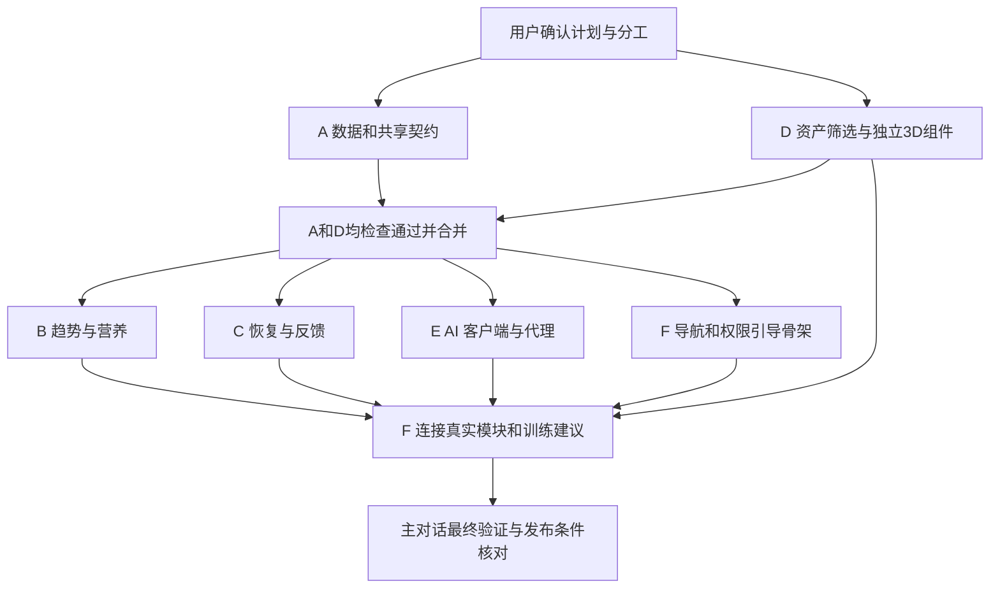

# 健康分析：并行工作树与交付计划

## 状态和授权边界

- 日期：2026-10-03；状态：**计划中，用户已确认分工；待文档 PR 当前提交 CI 通过并合并后创建实施对话**。
- 需求基线：[实施提案](health-analysis-plan.md)；研究来源：[证据矩阵](health-analysis-evidence.md)。
- 用户已批准先完成并合并 A、D，再创建 B、C、E、F；每个实施对话各自 fetch 最新远端默认分支，使用独立新工作树。本文件的消息模板不代表任务已经派发，实际 threadId/工作树/PR 状态以主对话及 Git 为准。
- 当前 `agent/health-analysis-plan` 是本对话的文档分支，复用已有独立工作树；不得把它当作某个已启动的功能分支。
- 后续实施对话使用用户默认模型，`thinking: high`。不擅自把 high 改成其他 effort，不指定用户未要求的模型。
- 用户本次授权覆盖创建对话、独立工作树、实施、验证、提交、推送，以及本范围 PR 审阅和当前 head CI 通过后的 squash 合并，由主对话统一协调。**付费采购、正式部署和发布仍需具体授权**。

## 为什么按六条工作流拆分

两个页面共享数据、权限和计算契约；直接按页面各自实现，会重复建模并争抢迁移、备份和导航文件。
先落地一个可编译的基础层，再让趋势、恢复、3D、AI 独立推进，由集成工作流连接完整体验。
主对话负责需求、契约变更、PR 审阅、集成次序与最终验收；子对话不自行扩大范围。

| 工作流 / 拟议对话名 | 拟议分支 | 独占职责 | 主要交付 |
| --- | --- | --- | --- |
| A 数据与 Apple 健康 | `agent/health-foundation` | 新实体、迁移/备份、HealthKit 同步、授权状态、共享值类型和 fake 服务 | 可独立测试的数据基础与稳定契约 |
| B 趋势分析与营养目标 | `agent/trend-analysis` | 趋势算法、目标建议和历史查询、趋势页面 | 可解释、可暂停/撤销的自适应营养功能 |
| C 肌群恢复与反馈 | `agent/recovery-analysis` | 肌群映射、负荷/准备度、反馈与校准、恢复页容器、RIR 录入 | 可复现的恢复结果与肌群详情 |
| D 3D 人体展示 | `agent/recovery-body-map` | 资产许可、模型处理、3D 渲染/选择、无障碍列表 | 与恢复计算解耦的可点击人体组件 |
| E DeepSeek 报告服务 | `agent/ai-health-reports` | iOS 报告客户端、代理服务、鉴权/限流、提示知识与输出校验 | 合成数据端到端报告和故障降级 |
| F 导航、建议与最终集成 | `agent/health-integration` | 五 Tab、首页建议、资料库入口、首启引导/设置、推荐规则、整体体验 | 两个新模块连入现有产品，原流程不退化 |

这些是职责拆分，不是工时承诺。共享基础、资产许可和外部服务条件决定关键路径。

## 文件所有权与冲突处理

下表中新目录均为计划路径；当前不存在时由对应任务创建。

| 所有者 | 可以提交的文件/目录 | 明确不负责 |
| --- | --- | --- |
| A | `Trainote/Models/Health/`、`Trainote/Services/Analysis/Contracts/`、`Trainote/Services/HealthData/`、授权/偏好持久化服务；`WorkoutModels.swift` 新字段、`BackupArchive.swift`、`TrainoteApp.swift` 的 schema/初始服务注入；迁移/备份/健康同步测试 | 趋势/恢复公式、AI 网络、页面导航 |
| B | `Trainote/Services/Analysis/Trend/`、`Trainote/Features/Trends/`、`TrainoteTests/Trend*`、趋势模块独立 UI 测试 | 修改共享实体、全局 NutritionSummary 和 Settings、AppShell |
| C | `Trainote/Services/Analysis/Recovery/`、`Trainote/Features/Recovery/`（不含 BodyMap 子目录）、`ExerciseMuscleMap.json`、`ActiveWorkoutView.swift` 和训练草稿/复制流程的 RIR 行为、恢复及 RIR 测试 | `.pbxproj`、备份结构、3D 资产、AI 网络 |
| D | `Trainote/Features/Recovery/BodyMap/`、`Trainote/Resources/BodyMap/`、组件测试与资产许可记录 | 计算分数、HealthKit、RecoveryView 页面容器 |
| E | `Trainote/Services/AIReports/`、`Trainote/Features/AIReports/` 可复用报告卡片、`Server/`、报告 fixture/校验测试、AI 独立 CI 工作流 | 目标/恢复公式、健康读取、全局页面壳层、正式部署 |
| F | `AppShell.swift`、`TodayView.swift`、`SettingsView.swift`、`LibraryView.swift`、训练/饮食列表的资料库入口、`Features/Onboarding/`、`Services/Analysis/Recommendations/`、现有营养汇总的目标历史适配、整体 UI 测试、实际隐私/帮助/App Store 文案 | 重写其他任务核心算法、无授权部署/发布 |
| 主对话 | `project.yml`、生成的 `.pbxproj`/scheme、entitlements、原 iOS CI 配置、规划索引和共享文档的最终同步；PR 检查及合并协调 | 替换用户的无关本地修改、提前宣布模型已验证 |

- A 的 `TrainoteApp.swift` 所有权在 A 合并后移交 F，F 才添加最终生产服务装配；两者不同时编辑。
- A 一次性建立两模块需要的实体与 RIR 字段。B/C 若发现契约缺口，先向主对话报告，由 A 或后续指定唯一负责人补齐，不各自建第二套字段。
- `NutritionGoal` 兼容写入由基础仓储提供；B 生成 proposal，F 负责旧页面消费适配，避免 B/F 同时维护两套“当前目标”。
- A 冻结共享 `BodyMapPresentation` 类型，D 消费它并使用 fixture 验证组件；后续 C 从恢复结果构造 presentation 并集成 D，不能要求先实现 C 才能完成 D。
- 各工作流可在本工作树临时生成 Xcode 工程进行构建，但共享工程文件由主对话统一生成并加入相应 PR 最终提交；不可拿未包含 source 的工程声称测试覆盖新文件。
- 所有任务明确“不是独自在代码库中，保留他人修改”；发现共享文件冲突报告主对话，不 hard reset、不覆盖或还原其他任务工作。
- 修改算法/合同规则必须同 PR 更新对应规划段落，并由主对话确认后通知消费者；文档不是冻结后允许实现漂移的旧副本。

## 执行波次与依赖

### 波次 0：已确认

- 用户已确认五 Tab/资料库入口、默认营养建议采用方式、六条工作流及 high 设置。
- 已授权本范围 PR 经审阅和当前 head CI 通过后 squash 合并；无需为相同范围重复请求，但发现实质新增范围、费用或不可逆操作时另行处理。
- 模型、托管、资产购买和正式发布的外部条件可以保持待确认；它们不阻塞使用 fake/合成数据的开发，但会限制真实链路验收。

### 波次 1：A 与 D

- A 先实现共享 DTO、仓储协议、完整合成 fixtures、版本和错误语义，再接新实体、备份、HealthKit 适配。
- 共享 fixture 至少覆盖：训练＋饮食完整、缺少 HRV、仅手动记录、未知肌群、拒绝 AI、跨午夜睡眠、健康来源重复、旧备份。
- A 验收后提交 ready PR；主对话审阅并核查当前 head CI 后协调合并。
- D 可同时核实资产、准备静态姿态与肌群 mesh 命名、完成独立 renderer；公共 DTO 未进入主线前仅使用内部 preview adapter，不往共享路径发布替代定义。
- 付费资产先提交可查看样张、来源、许可和成本，等待具体购买授权；免费且许可清楚的资产可按批准范围处理。

### 波次 2：B / C / E 并行，F 做集成骨架

- **A、D 均完成并合并，且默认分支对应最终内容核实后**，才创建 B/C/E/F。各任务先 fetch，再从最新远端默认分支建立自己的独立新工作树；不得直接在 canonical checkout 或其他任务工作树开发。
- B/C/E 通过 A 的协议和 fixtures 独立运行；F 先连 fake 页面/报告完成导航、首启和授权拒绝路径。
- D 在已有分支同步已合并的 A，接正式 DTO；不另起重复任务。
- A 或 D 任一未完成/未合并时不创建 B/C/E/F 实施对话；主对话处理前置阻塞，不能绕过用户指定的双前置顺序。

### 波次 3：逐个 PR 集成

- B/C/D/E 的 PR 可独立审阅；F 只引用已进入默认分支的实际实现。
- C 与 D 的集成采用适配器接口，不把 3D 渲染代码塞进计算引擎。
- 各次合并后由主对话刷新默认分支，F 在自身分支正常同步，不强推重写无关提交。
- 真实 AI 仅在用户同意链路、供应商条款、签名认证、预算和部署授权齐备后启用；此前 fake/本地报告必须清楚标为测试或基础报告。

### 波次 4：最终验收

- 主对话复核最终 diff、所有 PR 内容、CI 对应 head、完整回归、真机健康读取/撤回、旧库迁移、3D 和辅助功能证据。
- 工程交付、算法有效性、真实服务部署、TestFlight/App Store 分别报告；不把任意一项替代其他项。
- 只有授权合并后的资源才进入清理：检查独有提交、未跟踪/有意义忽略数据、活动进程及工作树依赖；保护不确定内容。
- canonical checkout `/Users/jerryszz/Desktop/Projects/trainote` 最终安全同步实际默认分支，核对 remote/head；保留其他正在使用的工作树和分支。

## 创建对话的操作约定（按已批准波次执行）

1. 用 `list_projects` 获取 Trainote 的当前 projectId，不能把目录名当 ID。
2. 检查当前远端默认分支和引用，再调用 `create_thread`：`target.type=project`、`environment.type=worktree`、对应 projectId、`thinking=high`，省略 model。
3. 新任务从当时最新远端默认分支开始，按上表使用 `agent/` 分支。继续已有任务或修 PR 时留在原任务分支，不重复创建工作树。
4. 每个初始消息附规范的默认分支提交 SHA、计划路径、独占文件、允许动作、禁止改动和验收条件。未获授权的合并/部署/付费明确写出边界。
5. 正在创建时保留返回的 clientThreadId，只在正式 threadId 就绪后用于后续工具。对外给出创建对话卡片；核查每个工作树路径、分支和起始提交，不以创建按钮成功替代隔离证据。
6. 用 `wait_threads` 获取进度和需要关注的事件；主对话发送任务内必要的跟进。不让子对话自行广播给其他聊天。
7. 有阻塞时先提交具体成果和复现信息；不能为了追求并行让其他任务盲猜共享契约。

## 待派发的消息草稿

以下每条在实际派发前都要补上已批准计划所在的 commit/PR 和当前默认分支 SHA，不能把本地尚未合并的文件路径当作其他工作树已有内容。
若文档 PR 尚未进入默认分支，先解决其合并授权和可读性，不创建看不到规范的实施任务。

### 所有任务共用前置说明

> 实施已获用户批准的 Trainote 健康分析计划。先阅读 docs/planning/README.md、health-analysis-plan.md、health-analysis-evidence.md、health-analysis-delivery.md，并检查工作区与适用 AGENTS.md。按分配范围工作，不扩大需求。
> 使用独立工作树和 agent/ 分支，从本消息指定的最新远端默认分支开始。你不是独自在代码库中，保留其他人的修改，不还原或覆盖他人的工作。
> 计算规则中的 P 参数是待验证初值，不能把论文说成对本产品分数的直接证明。HealthKit 与 AI 同意分开，没有数据返回未知；未获授权不得发送真实健康数据或创建付费服务。
> 完成最小有意义验证，提交并推送范围内变化，创建 ready PR，附实际验证和未解决事项；不要自动请求新一轮 review。共享工程生成由主对话协调，最终 CI 必须包含所有新 source。
> 合并、部署和发布以主对话列明的当前授权为准；未明确授权时停在可审阅 PR。effort=high，模型使用用户默认设置。

### A：数据与 Apple 健康

> 负责共享契约、全体新增实体、schema/备份兼容、训练 RIR 数据字段、HealthKit 读取与删除增量、数据来源/缺失语义、AI 同意持久化服务及 fake fixtures。不做公式和分析页面。先交付可编译、可测试的接口，再完成适配。必须覆盖旧库和 v1 备份、健康权限不可推断、重复/删除样本和授权不随备份恢复。报告共享契约冻结点、迁移证据及真机待验项。

### B：趋势分析与营养目标

> 负责趋势计算、摄入完整度、每周 proposal 与 hold/revoke、碳蛋脂计算、目标历史查询和趋势页面。使用 A 的实体/仓储，不改共享 schema、Settings 或 AppShell。P 参数集中版本化。验证稀疏/异常数据、调整方向、重复 proposal、手动/自动模式、舍入和记录不足不调整。完成趋势模块 PR，提供固定 fixture 的可复核结果。

### C：肌群恢复与反馈

> 负责肌群映射、完成工作组/RIR 负荷、恢复候选算法、局部与全身状态分离、体感/疼痛反馈、保守个体校准、恢复页容器及训练中的 RIR 录入/复制重置。只消费 D 的 BodyMapPresentation 接口，不处理模型资产。验证旧数据未知值、未完成训练不计入、时间衰减、缺数据、映射覆盖和反馈不能循环证明有效。算法参数与证据对应关系随 PR 交付。

### D：3D 人体展示

> 负责合法可分发人体资产的选择/处理、肌群 mesh 命名和映射、旋转/前后视角/点击、颜色与文字状态、VoiceOver 列表及性能。先提供资产来源、许可和可查看效果；需要花钱先提出具体购买方案。不得拿现有文字动作集许可覆盖图片/模型。组件只消费 presentation DTO，不查询用户数据或算恢复分数。列表是降级，正常 3D 体验仍需验收。

### E：DeepSeek 报告服务

> 负责报告客户端、可替换 provider、结构化输入/输出、固定知识片段、事实/action ID 校验、本地报告 fallback、TypeScript 代理、设备认证/配额及服务测试。先用合成数据打通端到端；供应商条款和实际部署授权未齐备前不发送真实健康记录。无共享 API key 进入 App、无请求正文日志、无任意 prompt 开放代理。报告须引用计算结果，不能改写目标或生成未允许的训练动作。交付本地启动/测试方法和真实上线剩余条件。

### F：导航、建议与集成

> 负责五 Tab、保留资料库和原有入口、首页简短建议、首启分项同意及设置撤回、目标历史在旧页面中的适配、训练建议候选和完整 UI 流程。A 合并后接手 App 根依赖装配。先以 fake 实现骨架，后只集成已合并的 B/C/D/E。保留既有训练/饮食/备份行为，更新实际隐私帮助及商店准备资料。测试所有拒绝/部分数据/离线/重启场景，汇总真实设备和发布待办，不擅自部署或发布。

## 工作流验收摘要

| 工作流 | 最小相关验证 | 必须留给主对话的证据 |
| --- | --- | --- |
| A | SwiftData 旧库迁移、备份 v1/v2、同步/删除/来源 fixtures、同意状态 | schema/DTO 清单、测试结果、真机限制 |
| B | 纯函数趋势/目标测试、趋势页面核心流程 | 固定输入输出、参数版本、所有 hold reason |
| C | 映射审计、负荷/时间/未知测试、反馈/RIR 往返 | 1,324 ID 支持状态、参数及尚未验证的假设 |
| D | fixture 渲染、肌群点击、前后视图、辅助功能/性能实测 | 资产许可清单、截图/录屏、目标设备与降级结果 |
| E | 代理/客户端契约、无同意不请求、注入/错数/超时/配额 | 合成端到端证据、供应商/部署未满足条件 |
| F | 原功能回归、导航与首启、建议一致性、撤回/清理 | 整体路径证据、无障碍/真机情况、最终待办 |

CI 命令沿用仓库 iOS 工作流，实施时先枚举实际 Simulator，使用其 UDID；不沿用文档中的旧设备名作为当前可用事实。
代理服务依赖/脚本由 E 锁定后同步运行说明。文档审计脚本只能证明索引/本地链接，没有运行以上产品测试的含义。

## 本轮完成与尚未开始

- 已完成的范围：详细提案、研究证据、拟议并行分工及派发消息草稿。
- 本次状态更新时尚未开始：功能实现、实施对话/工作树创建、供应商开通、真实健康数据处理、资产购买、部署和发布。
- 用户已批准实施和范围内检查通过后的合并；派发和后续状态在主对话核查，不把批准状态误写成完成状态。
